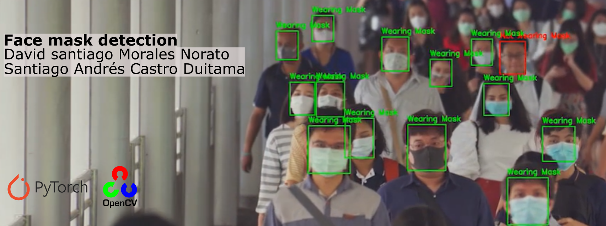

# ia2-proyecto

Se recomienda el uso de docker para la ejecución del proyecto, con la imagen de Pytorch y uso de cuda 11.1 si se ejecuta sobre una GPU NVDIA

<code>docker pull pytorch/pytorch:1.8.0-cuda11.1-cudnn8-devel</code>
